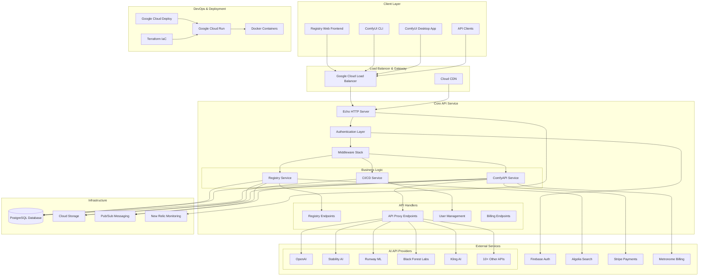
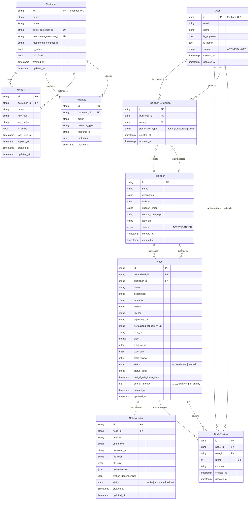
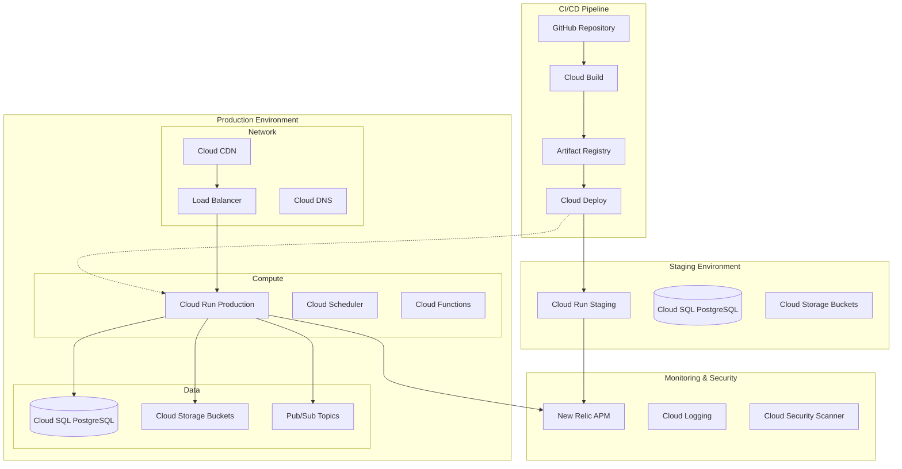
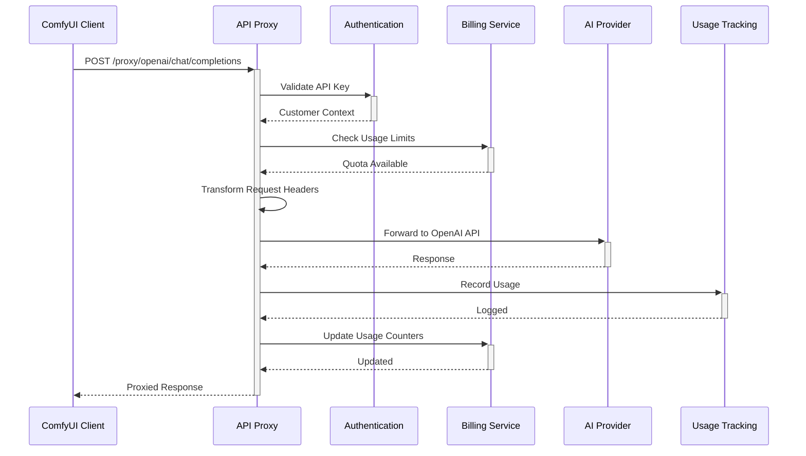

Please read the following architecture overview for the comfy-api repo and use as a guide for following tasks (will explain later after you have finished reading):

# ComfyUI Registry Backend - Architecture Overview

## 🎓 Backend Development Fundamentals

### For CS Developers New to Backend/Database Development

This document assumes familiarity with CS concepts but introduces backend-specific patterns. Here are the key paradigms this system demonstrates:

#### **Database-Centric Architecture**
Unlike frontend development where data is ephemeral, backend systems are built around **persistent data models**. This repo uses:
- **PostgreSQL**: A relational database where data is structured in tables with relationships

> **📖 PostgreSQL Explained**: PostgreSQL (often called "Postgres") is like the Swiss Army knife of databases. Born at UC Berkeley in 1986, it pioneered advanced features like JSON columns, full-text search, and custom data types while maintaining strict ACID compliance. Unlike MySQL (speed-focused) or SQLite (embedded), PostgreSQL balances performance with features. It supports both relational and NoSQL patterns, making it ideal for complex applications. The "Post" refers to its successor status to the earlier INGRES database project.
- **EntGo ORM (Object-Relational Mapping)**: Maps database tables to Go structs, eliminating SQL (Structured Query Language - database query language) boilerplate (see `ent/schema/*.go`)

> **📖 EntGo Name Origin**: "Ent" comes from Tolkien's Lord of the Rings - tree-like creatures that are ancient, persistent, and guardians of data (forests). Perfect metaphor for an ORM that guards your database schema! Facebook chose this name because ORMs manage the "roots" of your application (data models) and grow into complex relationship trees.

- **ACID Transactions (Atomicity, Consistency, Isolation, Durability)**: Database operations are atomic, consistent, isolated, and durable

> **📖 ACID Explained**: ACID guarantees are like safety contracts for your data. **Atomicity**: all-or-nothing (bank transfer either debits AND credits, or neither). **Consistency**: database rules always hold (can't have negative account balance). **Isolation**: concurrent operations don't interfere (two people can't withdraw the last $10 simultaneously). **Durability**: committed data survives crashes (your payment confirmation means it's really saved). Without ACID, databases would be unreliable for financial/critical data.

**Go Structs Explained**: A struct is Go's equivalent to a class without methods - a composite data type that groups related fields:
```go
type Node struct {
    ID          string    `json:"id"`
    Name        string    `json:"name"`
    Description *string   `json:"description,omitempty"` // pointer = nullable
    CreatedAt   time.Time `json:"created_at"`
}
```
**Key Differences from Python dicts/JS objects**:
- **Strongly Typed**: Each field has a fixed type, enforced at compile time
- **Memory Layout**: Fields stored contiguously in memory (like C structs)
- **Tags**: Metadata strings (backticks) control JSON serialization, DB mapping, validation
- **Pointer vs Value**: `*string` means nullable, `string` means required

> **📖 Pointers Explained**: A pointer is a variable that stores a memory address rather than a value directly. In Go, `*string` means "pointer to string" - it can be `nil` (null) or point to an actual string. Regular `string` is a value type that's always initialized. Think of pointers like house addresses: the address itself isn't the house, but tells you where to find it. Pointers enable nullable fields, shared memory, and efficient large data passing.

- **Zero Values**: Uninitialized fields get type defaults (empty string, 0, false, nil)
- **No Dynamic Fields**: Cannot add fields at runtime (unlike JS objects)

#### **API Design Patterns**
- **RESTful APIs (Representational State Transfer Application Programming Interfaces)**: HTTP (HyperText Transfer Protocol) verbs (GET, POST, PUT, DELETE) map to database operations (CRUD - Create, Read, Update, Delete)

> **📖 RESTful Explained**: REST is an architectural style invented by Roy Fielding that treats web resources as nouns (URLs like `/nodes/123`) and HTTP verbs as actions. Unlike RPC-style APIs where you call functions (`getNode(123)`), REST maps intuitive actions: GET `/nodes` (list all), POST `/nodes` (create), PUT `/nodes/123` (update), DELETE `/nodes/123` (remove). This creates predictable, cacheable APIs that web browsers understand natively.

- **Request/Response Cycle**: Every API call follows: validate → business logic → database → response
- **Middleware Chain**: Cross-cutting concerns (auth, logging, rate limiting) applied declaratively (see `server/middleware/`)

> **📖 Middleware Explained**: Middleware are functions that execute in a chain before your main handler, like Russian nesting dolls. Each middleware can inspect/modify the request, decide to continue or abort, and clean up after. Think of airport security: passport check → security scan → boarding pass → plane. In code: `auth → logging → rate-limiting → your-handler`. This pattern keeps concerns separated and reusable across endpoints.

#### **Service-Oriented Architecture**
- **Business Logic Layer**: Pure functions that operate on domain entities (see `services/`)

> **📖 Business Logic Explained**: Business logic is the core rules and workflows that make your application unique - not the technical plumbing. For ComfyUI Registry, business logic includes "a node must pass security scanning before publication" or "publishers can only edit their own nodes." It's the domain knowledge that would exist even if you switched from PostgreSQL to MongoDB or from HTTP to GraphQL. Keeping business logic separate from database/HTTP code makes it testable and reusable.

- **Data Access Layer**: Database queries abstracted behind interfaces (see `ent/`)
- **Integration Layer**: External service calls (Stripe, Algolia) isolated for testing (see `gateways/`)

#### **Stateless vs Stateful Design**
- **Stateless**: Each request contains all needed info; servers can be killed/restarted freely
- **Database as Single Source of Truth**: All persistent state lives in PostgreSQL
- **Caching**: Temporary state (Ristretto cache) for performance, never authoritative

#### **Concurrent Programming**
- **Goroutines**: Lightweight threads for handling multiple requests (Go's killer feature)

> **📖 Goroutines Explained**: In traditional languages, threads are expensive (1-2MB each) and creating thousands crashes your system. Goroutines are Go's lightweight threads (2KB each) that can spawn millions without issues. They're multiplexed onto OS threads automatically. Think of threads as heavy trucks (expensive, limited) vs goroutines as bicycles (cheap, unlimited). This lets Go handle 10,000 concurrent HTTP requests with ease, whereas traditional servers would collapse.

- **Database Connection Pooling**: Limited connections shared across requests

> **📖 Connection Pooling Explained**: Database connections are expensive to create (handshakes, authentication, memory allocation). Instead of creating/destroying connections per request, connection pools maintain a cache of ready-to-use connections. It's like a taxi dispatcher: instead of manufacturing a new taxi for each passenger, keep a fleet of 10 taxis serving all customers. This transforms O(requests) connection overhead into O(1).

- **Pub/Sub Messaging (Publish/Subscribe)**: Asynchronous processing for expensive operations (see node publishing flow)

> **📖 Pub/Sub Explained**: Publisher/Subscriber is like a newspaper delivery system. Publishers (newspaper companies) send messages to topics (like "Sports" or "Politics"). Subscribers (readers) register interest in topics and receive all messages. Unlike direct API calls, pub/sub is asynchronous - publishers don't wait for subscribers to process messages. Perfect for "fire and forget" operations like sending emails or processing file uploads.

#### **Infrastructure as Code**
- **Containers**: Applications packaged with dependencies (see `Dockerfile`)
- **Orchestration**: Cloud platforms manage scaling, health checks, deployments (see `infrastructure/`)
- **Observability**: Logging, metrics, tracing for production debugging (see New Relic integration)

---

## Executive Summary

The ComfyUI Registry Backend is a sophisticated **Go-based microservice** that powers the [ComfyUI Registry](https://registry.comfy.org) and [ComfyUI CI/CD](https://ci.comfy.org) platforms. It serves as the central hub for managing custom ComfyUI node packs, handling API proxying for multiple AI services, and providing a complete developer ecosystem for the ComfyUI community.

**Key Functions:**
- 🎨 **Node Registry**: Manages 1000+ custom ComfyUI node packages with versioning, reviews, and discovery
- 🔌 **API Proxy**: Unified gateway to 15+ AI APIs (OpenAI, Stability, Runway, etc.) with billing aggregation  
- 🚀 **CI/CD Platform**: Automated testing and deployment for ComfyUI extensions
- 💳 **Billing & Usage**: Integrated Stripe/Metronome for usage-based pricing across services
- 🔍 **Search & Discovery**: Algolia-powered search with intelligent categorization

---

## 🏗️ System Architecture



---

## 📊 Database Schema & Entity Relationships

### 🎓 Database Fundamentals Primer

**Relational Databases** organize data in tables with predefined schemas. Unlike NoSQL (document/key-value stores), relational DBs enforce **referential integrity** - relationships between entities are guaranteed to be valid.

**Key Concepts Demonstrated:**
- **Primary Keys (PK)**: Unique identifier for each row (like array indices, but immutable)

> **📖 Immutability Explained**: In programming, immutable means "cannot be changed after creation." Primary keys are immutable because changing them would break all foreign key references - like changing your social security number would break all systems that reference it. Immutable data structures prevent bugs by eliminating "spooky action at a distance" where modifying data in one place unexpectedly affects another. Go encourages immutability through value types and explicit copying.
- **Foreign Keys (FK)**: References to other table's primary keys (like pointers between objects)  
- **Unique Constraints (UK)**: Enforces no duplicates (like Set data structure)
- **Indexes**: B-tree structures for fast lookups (like hash tables for range queries)

> **📖 B-Trees Explained**: B-trees are the secret sauce behind fast database queries. Unlike hash tables (O(1) for exact matches only), B-trees support range queries in O(log n) time. They're like a well-organized library: books sorted by author allow you to quickly find "all books by authors M-P" without scanning everything. B-trees stay balanced automatically as data grows, maintaining logarithmic performance even with billions of records. Every database index uses B-trees or B+ trees under the hood.
- **ACID Properties**: Transactions ensure data consistency even with concurrent access

**ORM (Object-Relational Mapping)**: EntGo generates Go structs from schema definitions in `ent/schema/`, automatically handling:
- SQL (Structured Query Language) query generation

> **📖 Code Generation Explained**: Instead of writing repetitive boilerplate by hand, code generation analyzes your schema files and automatically produces type-safe database code. It's like having an AI assistant that writes perfect SQL queries, struct definitions, and validation logic based on your high-level descriptions. Benefits: zero typos, instant refactoring, consistent patterns. Languages use codegen to bridge the gap between human-friendly specifications and machine-optimized implementations.

- Type-safe database operations  
- Relationship loading (N+1 query prevention)
- Migration management

> **📖 Atlas Explained**: Atlas is like Git for your database schema. Traditional database migrations are irreversible scripts that can break production if written incorrectly. Atlas treats schema as declarative state (like Infrastructure as Code) and generates safe migration paths automatically. It can preview changes, detect conflicts, and rollback failed migrations. Think of it as "Terraform for databases" - you describe what you want, Atlas figures out how to get there safely.



---

## 🔧 Technology Stack & Library Analysis

### 🎓 Backend Technology Patterns

**HTTP (HyperText Transfer Protocol) Frameworks**: Unlike frontend frameworks (React/Vue) that manage UI (User Interface) state, backend frameworks handle request routing, middleware chains, and response formatting. They're closer to Express.js in Node.js.

**Database Layers**: Backend systems typically have 3 layers:
1. **Schema Definition** (`ent/schema/`): Like TypeScript interfaces but enforced at DB (Database) level
2. **Query Builder** (EntGo): Type-safe SQL (Structured Query Language) generation  
3. **Business Logic** (`services/`): Domain operations using entities

**Middleware Pattern**: Functions that wrap request handlers, similar to Python decorators or React HOCs (Higher-Order Components). Each middleware can:
- Modify request/response
- Short-circuit the chain (for auth failures)
- Add context (user info, request IDs)

**Gateway Pattern**: Abstracts external services behind interfaces, enabling:
- Mock implementations for testing
- Service substitution without code changes
- Centralized error handling and retry logic

### Core Framework
- **Echo v4.11.4**: High-performance HTTP framework chosen for its middleware ecosystem, minimal overhead, and excellent routing capabilities. Popular in Go for its balance of simplicity and power.

### Database & ORM
- **EntGo v0.14.4**: Facebook's Go ORM (Object-Relational Mapping) providing type-safe database operations with code generation. Solves the traditional Go database verbosity problem while maintaining performance.
- **PostgreSQL**: Primary database via `lib/pq` driver
- **Atlas**: Database migration management with version control

### Authentication & Security  
- **Firebase Admin SDK (Software Development Kit)**: Handles JWT (JSON Web Token) validation and user management

> **📖 SDK Explained**: A Software Development Kit is a collection of tools, libraries, documentation, and examples that make it easier to build applications for a specific platform. Think of it as a toolkit: instead of building a hammer from raw metal, the SDK provides pre-made tools. Firebase SDK handles complex tasks like cryptographic verification, token refresh, and API communication so developers can focus on business logic rather than authentication plumbing.

- **JWT (JSON Web Token, golang-jwt/jwt)**: Multiple versions for compatibility with different token formats

> **📖 JWT Explained**: JSON Web Tokens are like tamper-proof ID cards for the internet. Structure: Header (algorithm) + Payload (user data) + Signature (cryptographic proof). Unlike sessions stored on servers, JWTs are self-contained - all user info is in the token itself. The signature ensures nobody can forge or modify tokens without the secret key. This enables stateless authentication: servers don't need to "remember" logged-in users, making horizontal scaling trivial.

> **📖 Authentication Explained**: Authentication has evolved from simple passwords to sophisticated systems. **Traditional**: server stores sessions in memory/database (stateful, doesn't scale). **Modern**: cryptographic tokens prove identity without server storage (stateless, scales infinitely). **OAuth/OIDC**: delegate authentication to trusted providers (Google, Auth0) instead of handling passwords yourself. **Multi-factor**: combine something you know (password) + something you have (phone) + something you are (biometric) for stronger security.

- **Real IP Detection**: `tomasen/realip` for accurate client IP (Internet Protocol) extraction behind proxies

### External Service Integration
- **Google Cloud APIs (Application Programming Interfaces)**: Comprehensive integration (Storage, Pub/Sub, Monitoring, Compute)
- **Stripe SDK (Software Development Kit) v82**: Payment processing and subscription management
- **Algolia v3**: Search and discovery with real-time indexing
- **New Relic**: Application performance monitoring and observability (APM - Application Performance Monitoring)

> **📖 New Relic Explained**: New Relic is an observability platform that monitors application performance in production. It tracks metrics like response times, error rates, throughput, and database queries across your entire stack. Unlike simple logging, New Relic provides real-time dashboards, alerting, and distributed tracing to help debug issues in complex microservice architectures. It answers questions like "why is my API slow?" or "which database query is causing timeouts?" Essential for maintaining SLAs in production systems.

### Performance & Caching
- **Ristretto v2**: High-performance in-memory cache for hot data

> **📖 Ristretto vs Redis Explained**: **Ristretto** is an in-process cache (same memory as your application) optimized for high throughput and low latency - think of it as ultra-fast local storage. **Redis** is an external cache server (separate process/machine) that's slower but shared across multiple application instances. Ristretto is perfect for read-heavy data that doesn't change often (user profiles, configuration). Redis is better for data that needs to be shared or persisted across app restarts. The tradeoff: Ristretto = faster but isolated, Redis = slower but shared.

> **📖 Caching Strategies Explained**: **Cache-Aside**: app manages cache manually (read from cache, if miss then read from DB and populate cache). **Write-Through**: writes go to cache and DB simultaneously (slower writes, consistent data). **Write-Behind**: writes go to cache immediately, DB updated asynchronously (faster writes, risk of data loss). **TTL (Time-To-Live)**: cache entries expire automatically to prevent stale data. **LRU (Least Recently Used)**: evict oldest unused items when cache is full.

- **Brotli & gzip**: Multi-level compression for bandwidth optimization

> **📖 Compression Explained**: **Gzip** (1992) uses LZ77 algorithm for general-purpose compression, reducing text by ~70%. **Brotli** (2015, Google) uses advanced techniques achieving ~20% better compression than gzip with similar speed. Both are lossless - perfect reconstruction guaranteed. The choice: gzip for universal compatibility, Brotli for modern browsers wanting maximum bandwidth savings. This system uses both: Brotli for new clients, gzip fallback for old ones.

### Development & Testing
- **Testcontainers**: Docker-based integration testing
- **Air**: Live reload during development

> **📖 Air Explained**: Air is like nodemon for Go - it watches your source files and automatically rebuilds/restarts your server when changes are detected. Without Air, you'd manually stop the server, run `go build`, start the server after every code change. Air automates this cycle, providing instant feedback during development. It's especially valuable for Go since compilation is required (unlike interpreted languages). Think of it as a development accelerator that eliminates the "edit-compile-run" friction.

- **OpenAPI (Open Application Programming Interface) Codegen**: Automatic API client/server generation

> **📖 OpenAPI Explained**: OpenAPI (formerly Swagger) is like a contract for your API - a machine-readable specification describing every endpoint, parameter, and response. From this single YAML file, tools can generate: client SDKs in any language, server stubs, interactive documentation, validation code, and test cases. It's "API-first development": design the interface before implementation, ensuring frontend/backend teams can work in parallel. Changes to the spec automatically propagate to all generated code.

### Why These Libraries Were Chosen

1. **Echo over Gin/Fiber**: Better middleware ecosystem and stability for enterprise use

> **📖 Gin vs Fiber vs Echo Explained**: **Gin** prioritizes raw speed with minimal features - great for microservices but lacks enterprise middleware. **Fiber** mimics Express.js syntax but has a smaller ecosystem and breaking changes between versions. **Echo** balances performance with a mature middleware ecosystem (auth, CORS, rate limiting) and stable APIs. For production systems handling complex requirements, Echo's reliability trumps Gin's speed. Think: Gin = race car, Fiber = sports car, Echo = luxury sedan.

2. **EntGo over GORM (Go Object-Relational Mapping)**: Type safety and code generation reduce runtime errors  
3. **Ristretto over Redis (Remote Dictionary Server)**: In-memory caching eliminates network latency for hot data
4. **Firebase over Auth0**: Google ecosystem integration and cost efficiency

> **📖 Auth0 vs Firebase Auth Explained**: **Auth0** is authentication-as-a-service with extensive customization, social logins, and enterprise features (SSO, MFA). **Firebase Auth** is Google's simpler, cheaper alternative integrated with their ecosystem. Auth0 offers more flexibility but costs more and adds vendor dependency. Firebase Auth is free for most use cases and seamlessly integrates with Google Cloud services. Choice depends on complexity: Auth0 for enterprise needs, Firebase for simple authentication with Google services.

5. **Algolia over Elasticsearch**: Managed service reduces operational overhead

> **📖 Elasticsearch vs Algolia Explained**: **Elasticsearch** is a self-hosted search engine offering maximum control and customization - you manage clusters, sharding, indexing strategies. **Algolia** is search-as-a-service: upload data, get instant search with features like typo tolerance, faceting, and geo-search. Elasticsearch is powerful but requires dedicated ops team. Algolia is expensive but eliminates operational complexity. Trade-off: control vs convenience, cost vs complexity.

---

## 🚀 Service Architecture Deep Dive

### Registry Service (`services/registry/`)
**Primary Function**: Manages the ComfyUI node ecosystem

**Key Responsibilities:**
- Node publishing, versioning, and lifecycle management
- Security scanning integration via private Google Cloud Function
- Algolia search index management and synchronization
- Publisher management and permission systems
- Review and rating aggregation

**Notable Patterns:**
- Event-driven architecture using Google Pub/Sub for async processing
- Webhook integration for external CI/CD triggers
- File integrity verification using SHA256 hashing

### ComfyAPI Service (`services/comfy_api/`)
**Primary Function**: Unified API gateway and billing aggregation

**Supported Providers:**
```
┌─────────────────┬──────────────────┬─────────────────────┐
│ Provider        │ Capabilities     │ Billing Model       │
├─────────────────┼──────────────────┼─────────────────────┤
│ OpenAI          │ LLM, Vision      │ Token-based         │
│ Stability AI    │ Image Generation │ Per-image           │
│ Runway ML       │ Video Generation │ Per-second          │
│ Black Forest    │ Image/Video      │ Per-generation      │
│ Kling AI        │ Video Creation   │ Per-minute          │
│ Ideogram        │ Text-to-Image    │ Per-image           │
│ Recraft         │ Design Assets    │ Per-generation      │
│ Luma Labs       │ 3D Generation    │ Per-model           │
│ PixVerse        │ Video Editing    │ Per-operation       │
│ Pika Labs       │ Video Creation   │ Per-generation      │
│ Tripo3D         │ 3D Modeling      │ Per-model           │
│ Moonvalley      │ Video Generation │ Per-generation      │
└─────────────────┴──────────────────┴─────────────────────┘
```

**Key Features:**
- Request/response proxying with authentication injection
- Usage tracking and billing aggregation via Metronome
- Rate limiting and quota management per customer
- Error handling and retry logic with circuit breakers

### CI/CD Service (`services/comfy_ci/`)
**Primary Function**: Automated testing and deployment pipeline

**Workflow:**
1. GitHub webhook triggers on repository changes
2. Security scanning via private Google Cloud Function
3. Automated testing in isolated containers
4. Version validation and dependency checking
5. Automatic deployment to staging/production

---

## 🔐 Authentication & Authorization Flow

### 🎓 Auth Fundamentals for Backend Systems

**Authentication vs Authorization**:
- **Authentication**: "Who are you?" (identity verification)
- **Authorization**: "What can you do?" (permission checking)

**Stateless Authentication**: Unlike session-based auth (server stores user state), JWT (JSON Web Token) tokens contain all user info:
- **JWT (JSON Web Token) Structure**: Header.Payload.Signature (like a signed document)
- **Verification**: Cryptographic signature proves token wasn't tampered with
- **Scalability**: No server-side session storage needed

**Multi-Tenant Systems**: This system serves multiple types of users (registry users vs API customers) with different permission models:
- **Firebase Users**: Registry developers who publish nodes
- **API Customers**: Businesses using AI (Artificial Intelligence) proxy services  
- **Publishers**: Organizations with multiple collaborators

**Authorization Patterns**:
- **Role-Based**: Users have roles (admin/viewer) with preset permissions
- **Resource-Based**: Permissions tied to specific entities (can edit *this* node)
- **Context-Aware**: Permissions depend on request context (IP (Internet Protocol) whitelist, rate limits)

```mermaid
sequenceDiagram
    participant Client
    participant LoadBalancer
    participant AuthMiddleware
    participant Firebase
    participant Database
    participant BusinessLogic

    Client->>+LoadBalancer: Request with Bearer Token
    LoadBalancer->>+AuthMiddleware: Forward Request
    
    AuthMiddleware->>+Firebase: Validate JWT Token
    Firebase-->>-AuthMiddleware: User Claims
    
    AuthMiddleware->>+Database: Upsert User Record
    Database-->>-AuthMiddleware: User Entity
    
    AuthMiddleware->>AuthMiddleware: Check User Status & Permissions
    
    alt User Active & Authorized
        AuthMiddleware->>+BusinessLogic: Request with User Context
        BusinessLogic-->>-AuthMiddleware: Response
        AuthMiddleware-->>-LoadBalancer: Success Response
    else User Banned/Unauthorized
        AuthMiddleware-->>-LoadBalancer: 401/403 Error
    end
    
    LoadBalancer-->>-Client: Final Response
```

**Multi-Layer Security:**
- **Firebase JWT Validation**: Cryptographic signature verification
- **User Status Checks**: Active/banned status enforcement  
- **Publisher Permissions**: Granular access control (admin/collaborator/viewer)
- **API Key Management**: Customer-specific keys for API proxy access
- **Rate Limiting**: Per-customer and per-endpoint throttling
- **Audit Logging**: Complete activity tracking for compliance

---

## 🏗️ Infrastructure & Deployment

### 🎓 Cloud Infrastructure Concepts

**Traditional vs Cloud-Native**:
- **Traditional**: Physical servers, manual scaling, ops team manages hardware
- **Cloud-Native**: Managed services, auto-scaling, infrastructure as code

**Container Orchestration**: Unlike deploying directly to VMs (Virtual Machines), containers provide:
- **Consistency**: Same environment from dev to prod
- **Scalability**: Create/destroy instances based on load
- **Isolation**: Apps can't interfere with each other
- **Resource Efficiency**: Better utilization than full VMs (Virtual Machines)

**Managed Services vs Self-Hosted**:
- **Database**: Cloud SQL (Structured Query Language) vs managing PostgreSQL yourself
- **Message Queues**: Pub/Sub (Publish/Subscribe) vs running Redis/RabbitMQ
- **Load Balancing**: Cloud Load Balancer vs nginx configuration
- **Monitoring**: New Relic vs Prometheus + Grafana setup

**Infrastructure as Code (IaC - Infrastructure as Code)**: Terraform files in `infrastructure/` define cloud resources declaratively:
- **Version Control**: Infrastructure changes are code-reviewed
- **Reproducibility**: Spin up identical environments for testing
- **Rollback**: Git revert infrastructure changes
- **Documentation**: Infrastructure self-documents through code

**Blue-Green Deployment**: Zero-downtime deployments by:
1. Deploy new version alongside old (blue/green)
2. Route small percentage of traffic to new version
3. Monitor metrics, gradually shift all traffic
4. Keep old version ready for instant rollback

### Google Cloud Platform Architecture



### Terraform Infrastructure as Code

**Module Structure:**
- **`compute/`**: Cloud Run services, Cloud Functions, storage buckets
- **`network/`**: Load balancers, CDN, DNS configuration  
- **`alert/`**: Monitoring alerts for all services (deploy, scheduler, registry)
- **`cicd/`**: Build triggers, artifact registries, deployment pipelines

**Environment Management:**
- **Staging**: Automatic deployment from `main` branch
- **Production**: Manual promotion via Cloud Deploy
- **Local Development**: Docker Compose with Supabase

### Deployment Pipeline

1. **Build Phase**: 
   - Multi-stage Docker build with Go 1.23.6
   - Dependency caching for faster builds
   - Static binary compilation for minimal Alpine image

2. **Migration Phase**:
   - Atlas-managed database migrations
   - Automatic schema validation
   - Rollback capability for failed migrations

3. **Deployment Phase**:
   - Blue-green deployment via Cloud Run
   - Health checks and gradual traffic shifting
   - Automatic rollback on deployment failure

---

## 🔍 API Design & Proxy Architecture

### OpenAPI-First Development
The system follows an **OpenAPI 3.0 specification-driven** approach:

- **Code Generation**: Automatic client/server code generation via `oapi-codegen`
- **Contract Testing**: Schema validation ensures API consistency
- **Documentation**: Living documentation that stays in sync with implementation

### API Proxy Pattern



**Proxy Benefits:**
- **Unified Billing**: Single invoice across 15+ AI providers
- **Rate Limiting**: Customer-specific quotas and throttling
- **Usage Analytics**: Detailed per-customer, per-provider metrics
- **Error Handling**: Standardized error responses and retry logic
- **Authentication**: Single API key for all providers

---

## 📈 Performance & Scalability

### 🎓 Backend Performance Concepts

**Caching Layers**: Unlike frontend caching (browser cache, CDN - Content Delivery Network), backend systems have multiple cache levels:
- **Application Cache**: In-memory data (Ristretto) for frequently accessed objects
- **Database Query Cache**: PostgreSQL keeps query results in memory
- **CDN (Content Delivery Network) Cache**: Geographic distribution of static assets
- **Cache Invalidation**: "There are only two hard things..." - keeping cache consistent

**Database Performance**:
- **Indexing**: B-tree structures for fast lookups (like sorted arrays for O(log n) search)
- **Connection Pooling**: Reuse database connections (expensive to create)
- **Query Optimization**: EXPLAIN ANALYZE shows query execution plans
- **Read Replicas**: Route read queries to separate DB (Database) instances

**Horizontal vs Vertical Scaling**:
- **Vertical**: Bigger servers (more CPU/RAM - Central Processing Unit/Random Access Memory) - easier but has limits
- **Horizontal**: More servers - harder but unlimited scaling
- **Stateless Design**: Required for horizontal scaling (any server can handle any request)

**Load Balancing Algorithms**:
- **Round Robin**: Requests distributed evenly across servers
- **Least Connections**: Route to server with fewest active requests  
- **Geographic**: Route based on client location

### Caching Strategy
- **Ristretto In-Memory Cache**: Hot data (user sessions, node metadata)
- **HTTP (HyperText Transfer Protocol) Response Caching**: CDN (Content Delivery Network)-level caching for static content
- **Database Query Optimization**: Proper indexing and query planning

### Horizontal Scaling
- **Stateless Design**: No server-side session storage
- **Cloud Run Auto-scaling**: Automatic scaling based on request volume
- **Database Connection Pooling**: Efficient connection management

### Monitoring & Observability
- **New Relic APM (Application Performance Monitoring)**: Application performance monitoring
- **Custom Metrics**: Business-specific KPIs (Key Performance Indicators - node downloads, API usage)
- **Structured Logging**: JSON (JavaScript Object Notation) logs with correlation IDs
- **Distributed Tracing**: Request flow across services

---

## 🧪 Testing Strategy

### Multi-Layer Testing Approach

1. **Unit Tests**: Business logic validation with mocks
2. **Integration Tests**: Database and external service integration via Testcontainers
3. **Contract Testing**: OpenAPI (Open Application Programming Interface) schema validation
4. **End-to-End Testing**: Critical user journeys

### Test Infrastructure
- **Testcontainers**: Isolated PostgreSQL instances for integration tests
- **Mock Services**: Generated mocks for external dependencies
- **Test Data Management**: SQL (Structured Query Language) fixtures and factory patterns

---

## 🚨 Security & Compliance

### Data Protection
- **Encryption**: TLS (Transport Layer Security) 1.3 for data in transit, AES (Advanced Encryption Standard)-256 for data at rest
- **PII (Personally Identifiable Information) Handling**: Minimal collection, secure processing, GDPR (General Data Protection Regulation) compliance
- **API (Application Programming Interface) Key Security**: Hashed storage, prefix-based identification

### Security Scanning
- **Node Package Scanning**: Private Google Cloud Function for vulnerability detection
- **Dependency Scanning**: Automated checks for known vulnerabilities
- **Container Security**: Minimal Alpine-based images with security updates

### Audit & Compliance
- **Audit Logging**: Complete activity tracking with immutable logs
- **Access Controls**: Role-based permissions with principle of least privilege
- **Data Retention**: Configurable retention policies for different data types

---

## 🎯 Business Impact & Metrics

### Registry Ecosystem
- **Node Packages**: 1000+ published packages
- **Downloads**: Millions of node installations
- **Publishers**: Hundreds of active developers
- **Reviews**: Community-driven quality assessment

### API Proxy Usage
- **Requests**: Millions of API (Application Programming Interface) calls proxied monthly
- **Cost Savings**: 20-30% reduction in AI (Artificial Intelligence) API costs through aggregation
- **Providers**: 15+ AI services unified under single interface
- **Uptime**: 99.9% availability SLA (Service Level Agreement)

---

## 🔮 Future Architecture Considerations

### Planned Enhancements
1. **GraphQL (Graph Query Language) API**: More flexible client queries
2. **WebSocket Support**: Real-time notifications and updates
3. **Edge Computing**: Regional API proxying for reduced latency
4. **Machine Learning**: Intelligent node recommendations and categorization

### Scalability Roadmap
1. **Database Sharding**: Horizontal partitioning for massive scale
2. **Event Sourcing**: Immutable event log for audit and replay capabilities
3. **CQRS (Command Query Responsibility Segregation) Pattern**: Separate read/write models for optimized performance
4. **Microservices**: Further decomposition for team autonomy

---

This architecture represents a modern, cloud-native approach to building a developer platform that balances performance, security, and developer experience while maintaining operational simplicity and cost efficiency.